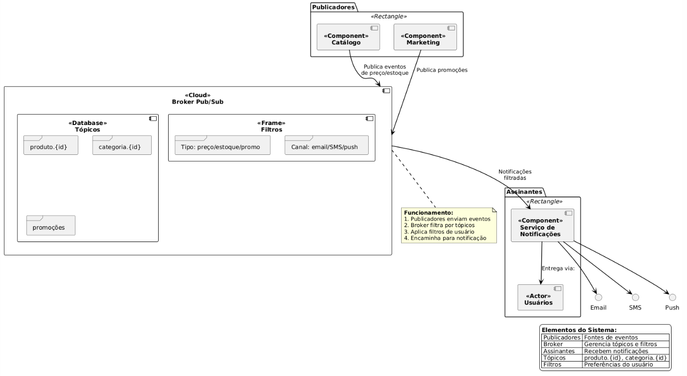

# Sistema de Notificações para E-Commerce Baseado em Pub/Sub
## Introdução

A arquitetura baseada no padrão Publish/Subscribe (Pub/Sub) permite comunicação indireta e desacoplada entre os componentes do sistema. No contexto de um e-commerce, essa abordagem facilita a entrega eficiente e personalizada de notificações sobre mudanças de preço, estoque e promoções, utilizando canais como email, SMS e push.

O diagrama apresentado ilustra claramente essa arquitetura, com três blocos principais:

- Publicadores: componentes que disparam eventos.
- Broker Pub/Sub: gerencia os tópicos, filtros e roteamento.
- Assinantes: recebem notificações por meio do Serviço de Notificações.

### 1. Arquitetura Geral
A comunicação é assíncrona e indireta. O fluxo é:

- Publicadores enviam eventos ao Broker Pub/Sub.
- O Broker organiza os eventos por tópicos e aplica filtros de usuário.
- As notificações filtradas são encaminhadas ao Serviço de Notificações.
- O serviço entrega a mensagem via email, SMS ou push, conforme preferência do usuário.

#### 1.1 Diagrama


---

### 2. Componentes Detalhados
#### 2.1 Publicadores
Representados no topo do diagrama, temos dois componentes:
##### «Component» Catálogo:
- Envia eventos relacionados a alteração de preço ou disponibilidade.

**Exemplo:**

```json

{
  "tipo": "preco_alterado",
  "produto_id": "789",
  "novo_preco": 219.90
}
```

##### «Component» Marketing:
- Publica eventos de promoção geral.

**Exemplo:**

```json
{
  "tipo": "promocao_flash",
  "categoria": "livros",
  "desconto": "20%"
}
```
**Ambos os componentes enviam seus eventos diretamente ao Broker, como mostrado pelas setas no diagrama.**

#### 2.2 Broker Pub/Sub (Cloud)
Localizado no centro do diagrama, o Broker é composto por:

##### Tópicos [«Database»]
- produto.{id}:
  - Tópicos granulares para produtos específicos.
  - Exemplo: produto.123 para uma geladeira.

- categoria.{id}:
  - Para monitoramento por categoria.
  - Exemplo: categoria.informatica.

- promocoes:
 - Tópico genérico para eventos de marketing.

##### Filtros [«Frame»]
- Tipo: define o tipo de evento (preço, estoque, promoção).
- Canal: filtra pelo meio preferido de entrega (email/SMS/push).

**Esses filtros são essenciais para personalizar as notificações com base nas preferências dos usuários, permitindo que apenas notificações relevantes sejam entregues.**

#### 2.3 Assinantes
Na parte direita do diagrama, temos os assinantes:

##### «Component» Serviço de Notificações:
- Responsável por entregar notificações filtradas.
-Conecta-se diretamente aos canais:
   - Email (via SMTP)
   - SMS (via gateway como Twilio)
   - Push (via Firebase Cloud Messaging ou Apple Push Notification Service)

##### «Actor» Usuários
- Representa os destinatários finais das notificações.
- As setas mostram claramente que os usuários escolhem como desejam ser notificados.

---

### 3. Funcionamento Detalhado
A área em destaque no diagrama explica o funcionamento básico:

#### 3.1 Inscrição do Usuário
- O usuário configura sua assinatura escolhendo:
  - Produtos e/ou categorias de interesse.
  - Tipos de eventos (ex: apenas promoções).
  - Canal de notificação desejado.
  - Exemplo: Usuário deseja ser notificado por push quando houver promoção na categoria games.

#### 3.2 Publicação
- O componente de Catálogo detecta que o produto PS5 teve o preço reduzido.
- Ele publica um evento no tópico produto.456 (exemplo).
- O Broker identifica quais assinantes seguem esse produto e aplicam os filtros.

#### 3.3 Entrega
- O evento passa pelos filtros (tipo e canal).
- O Serviço de Notificação recebe o evento filtrado.
- A notificação é entregue no canal configurado (ex: push notification via Firebase).

---

### 4. Exemplo de Implementação (Simulação em Código)

```python

# Simulação de tópicos
TOPICS = {
    'produto': 'produto.{id}',
    'categoria': 'categoria.{id}',
    'promocao': 'promocoes'
}

# Preferências do usuário
user_subscriptions = [
    {'topico': 'produto.123', 'tipo': 'preco', 'canal': 'email'},
    {'topico': 'categoria.games', 'tipo': 'promocao', 'canal': 'push'}
]

# Evento publicado
event = {
    'topico': 'categoria.games',
    'tipo': 'promocao',
    'conteudo': 'Desconto de 40% em jogos'
}

# Broker processa
for sub in user_subscriptions:
    if event['topico'] == sub['topico'] and event['tipo'] == sub['tipo']:
        send_notification(sub['canal'], event['conteudo'])

def send_notification(canal, msg):
    print(f"[{canal.upper()}] Enviando: {msg}")
```

---

### 5. Tabela de Elementos do Diagrama

|Elemento	                                        | Papel 
| ----------------------------------------------- | ------------------------------------------------------------------------------------------- |
|Publicadores|	Componentes que geram eventos (Catálogo e Marketing)
|Broker Pub/Sub	|Gerencia tópicos, aplica filtros e roteia notificações
|Tópicos	|Categorias de eventos (produto, categoria, promoções)
|Filtros	|Preferências de conteúdo e canal
|Assinantes	|Recebem notificações filtradas
|Serviço de Notificações	|Entrega mensagens por email, SMS ou push
|Usuários	|Ator final que configura suas preferências e recebe notificações

